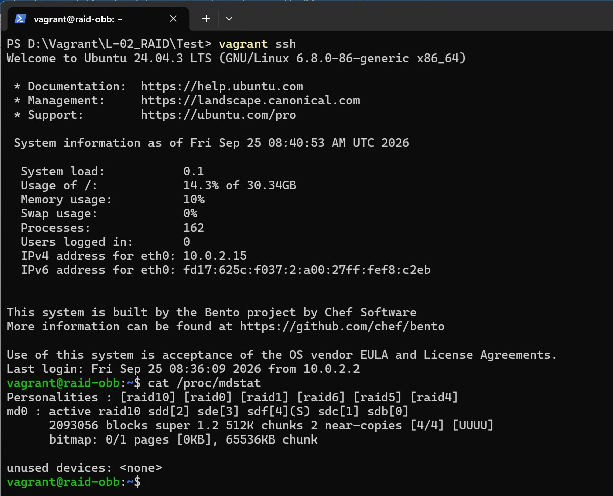
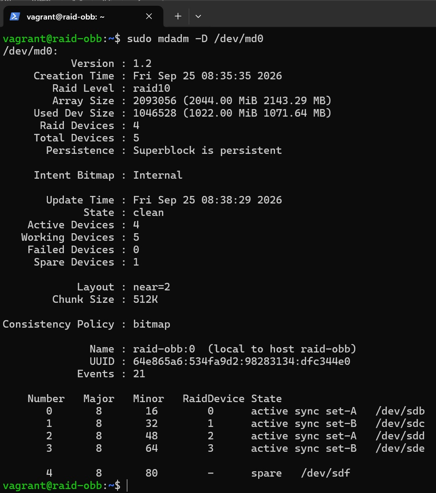
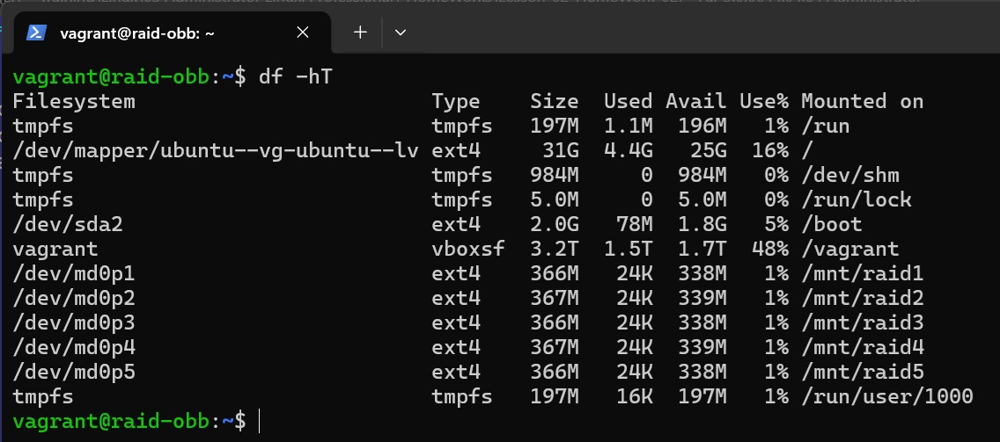

# Домашнее задание
##  Работа с mdadm
### Задание
- Добавьте в виртуальную машину несколько дисков
- Соберите RAID-0/1/5/10 на выбор
- Сломайте и почините RAID
- Создайте GPT таблицу, пять разделов и смонтируйте их в системе.

## Решение

### Vagrant 2.4.9, VirtualBox 7.2.16, на хосте с ОС Windows 11

Vagrant файл создает ВМ с гостевой ОС bento/ubuntu-24.04 со следующими параметрами:
* ОЗУ 2048Мб, CPU 2;
* 5 дисков по 1Gb (задаем в байтах 1073741824, чтобы избежать 'Gb' - хочет Vagrant и 'G' - выдает lsblk);
* выполняет прожинг 'create-raid-10.sh':
    * создает RAID-10 из 4х дисков;
    * добавляет Spare диск;
    * добавляет информацию о RAID`е в конфиг /etc/mdadm/mdadm.conf - связываем имя устройства массива с UUID массива;
    * обновляет загрузочный образ initramfs для сборки RAID массива в соотвествии с обновленным mdadm.conf;
* выполняет прожинг для созданного RAID массива'create-gpt.sh':
    * создает таблицу разделов GPT;
    * создает пять разделов;
    * монтирует разделы в /mnt/raid{1..5}
    * добавляет записи в /etc/fstab для автоматического монтирования при загрузке.

После выполнения сценария Vagrantfile зайдем на ВМ и проверим:

состояние RAID массива





монтирование разделов



### Сломать и починить RAID

```bash
# Из строя вышело устройство  /dev/sdb
sudo mdadm /dev/md0 --fail /dev/sdb
mdadm: set /dev/sdb faulty in /dev/md0

# Состояние RAID массива: неисправный диск sdb автоматически заменен запасным диском sdf
cat /proc/mdstat
Personalities : [raid0] [raid1] [raid6] [raid5] [raid4] [raid10]
md0 : active raid10 sdf[4] sde[3] sdd[2] sdc[1] sdb[0](F)
      2093056 blocks super 1.2 512K chunks 2 near-copies [4/4] [UUUU]
      bitmap: 0/1 pages [0KB], 65536KB chunk

unused devices: <none>

sudo mdadm -D /dev/md0
/dev/md0:
           Version : 1.2
     Creation Time : Fri Sep 25 08:48:18 2026
        Raid Level : raid10
        Array Size : 2093056 (2044.00 MiB 2143.29 MB)
     Used Dev Size : 1046528 (1022.00 MiB 1071.64 MB)
      Raid Devices : 4
     Total Devices : 5
       Persistence : Superblock is persistent

     Intent Bitmap : Internal

       Update Time : Fri Sep 25 09:05:31 2026
             State : clean
    Active Devices : 4
   Working Devices : 4
    Failed Devices : 1
     Spare Devices : 0

            Layout : near=2
        Chunk Size : 512K

Consistency Policy : bitmap

              Name : raid-obb:0  (local to host raid-obb)
              UUID : 490a0b62:0bf11b83:181f9a7e:c5ab8877
            Events : 38

    Number   Major   Minor   RaidDevice State
       4       8       80        0      active sync set-A   /dev/sdf
       1       8       32        1      active sync set-B   /dev/sdc
       2       8       48        2      active sync set-A   /dev/sdd
       3       8       64        3      active sync set-B   /dev/sde

       0       8       16        -      faulty   /dev/sdb

# Удалим из массива неисправный диск sdb

sudo mdadm /dev/md0 --remove /dev/sdb
mdadm: hot removed /dev/sdb from /dev/md0

# Состояние массива: 
cat /proc/mdstat
Personalities : [raid0] [raid1] [raid6] [raid5] [raid4] [raid10]
md0 : active raid10 sdf[4] sde[3] sdd[2] sdc[1]
      2093056 blocks super 1.2 512K chunks 2 near-copies [4/4] [UUUU]
      bitmap: 0/1 pages [0KB], 65536KB chunk

sudo mdadm -D /dev/md0
/dev/md0:
           Version : 1.2
     Creation Time : Fri Sep 25 08:48:18 2026
        Raid Level : raid10
        Array Size : 2093056 (2044.00 MiB 2143.29 MB)
     Used Dev Size : 1046528 (1022.00 MiB 1071.64 MB)
      Raid Devices : 4
     Total Devices : 4
       Persistence : Superblock is persistent

     Intent Bitmap : Internal

       Update Time : Fri Sep 25 09:20:38 2026
             State : clean
    Active Devices : 4
   Working Devices : 4
    Failed Devices : 0
     Spare Devices : 0

            Layout : near=2
        Chunk Size : 512K

Consistency Policy : bitmap

              Name : raid-obb:0  (local to host raid-obb)
              UUID : 490a0b62:0bf11b83:181f9a7e:c5ab8877
            Events : 39

    Number   Major   Minor   RaidDevice State
       4       8       80        0      active sync set-A   /dev/sdf
       1       8       32        1      active sync set-B   /dev/sdc
       2       8       48        2      active sync set-A   /dev/sdd
       3       8       64        3      active sync set-B   /dev/sde

# Добавим в массив "новый" запасной диск sdb

sudo mdadm /dev/md0 --add /dev/sdb
mdadm: re-added /dev/sdb

# Состояние массива

cat /proc/mdstat
Personalities : [raid0] [raid1] [raid6] [raid5] [raid4] [raid10]
md0 : active raid10 sdb[0](S) sdf[4] sde[3] sdd[2] sdc[1]
      2093056 blocks super 1.2 512K chunks 2 near-copies [4/4] [UUUU]
      bitmap: 0/1 pages [0KB], 65536KB chunk

unused devices: <none>

sudo mdadm -D /dev/md0
/dev/md0:
           Version : 1.2
     Creation Time : Fri Sep 25 08:48:18 2026
        Raid Level : raid10
        Array Size : 2093056 (2044.00 MiB 2143.29 MB)
     Used Dev Size : 1046528 (1022.00 MiB 1071.64 MB)
      Raid Devices : 4
     Total Devices : 5
       Persistence : Superblock is persistent

     Intent Bitmap : Internal

       Update Time : Fri Sep 25 09:25:48 2026
             State : clean
    Active Devices : 4
   Working Devices : 5
    Failed Devices : 0
     Spare Devices : 1

            Layout : near=2
        Chunk Size : 512K

Consistency Policy : bitmap

              Name : raid-obb:0  (local to host raid-obb)
              UUID : 490a0b62:0bf11b83:181f9a7e:c5ab8877
            Events : 40

    Number   Major   Minor   RaidDevice State
       4       8       80        0      active sync set-A   /dev/sdf
       1       8       32        1      active sync set-B   /dev/sdc
       2       8       48        2      active sync set-A   /dev/sdd
       3       8       64        3      active sync set-B   /dev/sde

       0       8       16        -      spare   /dev/sdb

```
