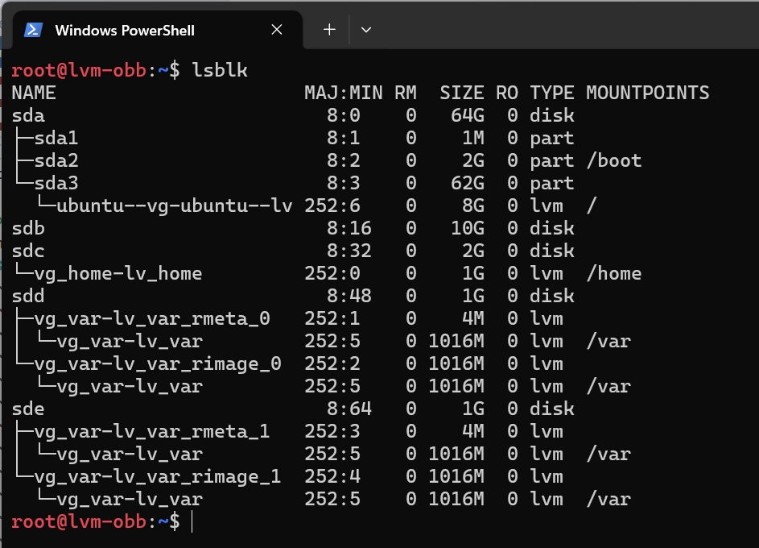

# Домашнее задание
##  Работа с LVM
### Задание
- Уменьшить том под / до 8G
- Выделить том под /home
- Выделить том под /var - сделать в mirror.
- /home - сделать том для снапшотов.
- Прописать монтирование в fstab. Попробовать с разными опциями и разными файловыми системами (на выбор).
- Работа со снапшотами:
  - сгенерить файлы в /home/;
  - снять снапшот;
  - удалить часть файлов;
  - восстановиться со снапшота.

## Решение

Список команд содержится в файле [lvm.sh](lvm.sh)

### Vagrant 2.4.9, VirtualBox 7.2.16, на хосте с ОС Windows 11

Vagrant файл создает ВМ с гостевой ОС bento/ubuntu-24.04 со следующими параметрами:
* ОЗУ 2048Мб, CPU 2;
* 4 диска с размерами: 10GB 2GB, 1GB, 1GB

Блочные устройства в системе


```bash
vagrant@lvm-obb:~$ lsblk
NAME                      MAJ:MIN RM SIZE RO TYPE MOUNTPOINTS
sda                         8:0    0  64G  0 disk
├─sda1                      8:1    0   1M  0 part
├─sda2                      8:2    0   2G  0 part /boot
└─sda3                      8:3    0  62G  0 part
  └─ubuntu--vg-ubuntu--lv 252:0    0  31G  0 lvm  /
sdb                         8:16   0  10G  0 disk
sdc                         8:32   0   2G  0 disk
sdd                         8:48   0   1G  0 disk
sde                         8:64   0   1G  0 disk
```

Все дальнейшие действия производим из под пользователя root

```bash
# Далее выполняем все команды из под рута
vagrant@lvm-obb:~$ sudo -i
```

### Уменьшить том под / до 8G

Создадим временный том для корневого раздела, перенесем на него все содержимое текущегокорневого раздела и подготовим его для загрузки.

```bash
# Создаем Physical volume и Volume group с именем "vg_root" на диске sdb
root@lvm-obb:~$ vgcreate vg_root /dev/sdb
  Physical volume "/dev/sdb" successfully created.
  Volume group "vg_root" successfully created

# Создаем Logical volume с именем lv_root в группе vg_root
root@lvm-obb:~$ lvcreate -n lv_root -L 8G vg_root
  Logical volume "lv_root" created.

# Форматируем Logical volume lv_root в ext4
root@lvm-obb:~$ mkfs.ext4 /dev/vg_root/lv_root
mke2fs 1.47.0 (5-Feb-2023)
Creating filesystem with 2097152 4k blocks and 524288 inodes
Filesystem UUID: 6c466554-c82d-4177-8515-d01406c854e2
Superblock backups stored on blocks:
        32768, 98304, 163840, 229376, 294912, 819200, 884736, 1605632

Allocating group tables: done
Writing inode tables: done
Creating journal (16384 blocks): done
Writing superblocks and filesystem accounting information: done

# Монтируем Logical volume lv_root в /mnt
root@lvm-obb:~$ mount /dev/vg_root/lv_root /mnt
mount: (hint) your fstab has been modified, but systemd still uses
       the old version; use 'systemctl daemon-reload' to reload.

# Копируем все данные из корня / в /mnt
root@lvm-obb:~$ rsync -avxHAX --progress / /mnt/
...
sent 4,537,497,792 bytes  received 838,088 bytes  101,985,075.96 bytes/sec
total size is 4,537,544,468  speedup is 1.00

# Сымитируем текущий root, сделаем в него chroot

# Cвяжем железное окружение текущей машины с новой системой, что позволяет полноценно «войти» в нее и запускать команды так, будто она загружена штатно.
root@lvm-obb:~$ for i in /proc/ /sys/ /dev/ /run/ /boot/; do mount --bind $i /mnt/$i; done
...
mount: (hint) your fstab has been modified, but systemd still uses
       the old version; use 'systemctl daemon-reload' to reload.

# Выполним смену корневого каталога
 root@lvm-obb:~$ chroot /mnt/

# Автоматически сгенерируем конфигурационный файл для загрузчика GRUB.
root@lvm-obb:/$ grub-mkconfig -o /boot/grub/grub.cfg
Sourcing file '/etc/default/grub'
Generating grub configuration file ...
Found linux image: /boot/vmlinuz-6.8.0-86-generic
Found initrd image: /boot/initrd.img-6.8.0-86-generic
Warning: os-prober will not be executed to detect other bootable partitions.
Systems on them will not be added to the GRUB boot configuration.
Check GRUB_DISABLE_OS_PROBER documentation entry.
Adding boot menu entry for UEFI Firmware Settings ...
done

# Обновим образ начальной файловой системы (initramfs) для текущего ядра Linux.
root@lvm-obb:/$ update-initramfs -u
update-initramfs: Generating /boot/initrd.img-6.8.0-86-generic

# Пробуем перезагрузиться
root@lvm-obb:/$ reboot
Running in chroot, ignoring request.

# Ошибка, т.к. команда reboot была запущена внутри изолированного окружения chroot, а не в основной системе. Из соображений безопасности systemd внутри chroot заблокирован и не может перезагрузить реальное физическое железо компьютера (хост-машину).

# Выходим из chroot в основную систему
root@lvm-obb:/$ exit

# Безопасно размонтируем виртуальные файловые системы хоста
root@lvm-obb:~$ for i in /proc/ /sys/ /dev/ /run/ /boot/; do umount -l /mnt/$i; done

# Перезагружаемся, чтобы работать с новым разделом
root@lvm-obb:~$ reboot
```


После загрузки с системы на временном томе, пересоздадим основной нужного размера, вернем на него его содержимое и подготовим его для загрузки, а заодно перенесеми /var.


```bash
# Посмотрим блочные устройства после перезагрузки и убедимся, что корень перехал на временный
root@lvm-obb:~$ lsblk
NAME                      MAJ:MIN RM SIZE RO TYPE MOUNTPOINTS
sda                         8:0    0  64G  0 disk
├─sda1                      8:1    0   1M  0 part
├─sda2                      8:2    0   2G  0 part /boot
└─sda3                      8:3    0  62G  0 part
  └─ubuntu--vg-ubuntu--lv 252:1    0  31G  0 lvm
sdb                         8:16   0  10G  0 disk
└─vg_root-lv_root         252:0    0   8G  0 lvm  /
sdc                         8:32   0   2G  0 disk
sdd                         8:48   0   1G  0 disk
sde                         8:64   0   1G  0 disk

# Т.к. ext4 плохо работает на сжатие, то пересоздадим основной раздел

# Удаляем старый основной раздел
root@lvm-obb:~$ lvremove /dev/ubuntu-vg/ubuntu-lv
Do you really want to remove and DISCARD active logical volume ubuntu-vg/ubuntu-lv? [y/n]: y
  Logical volume "ubuntu-lv" successfully removed.

# Создаем новый основной раздел с заданным размером 8GB
root@lvm-obb:~$ lvcreate -n ubuntu-lv -L 8G /dev/ubuntu-vg
WARNING: ext4 signature detected on /dev/ubuntu-vg/ubuntu-lv at offset 1080. Wipe it? [y/n]: y
  Wiping ext4 signature on /dev/ubuntu-vg/ubuntu-lv.
  Logical volume "ubuntu-lv" created.

# С новым основным разделом проделываем все те же манипуляции, что и с временным

# Форматируем Logical volume ubuntu-lv в ext4
root@lvm-obb:~$ mkfs.ext4 /dev/ubuntu-vg/ubuntu-lv
mke2fs 1.47.0 (5-Feb-2023)
Creating filesystem with 2097152 4k blocks and 524288 inodes
Filesystem UUID: 1ef157bb-d926-4668-a7a0-c191785e4ac8
Superblock backups stored on blocks:
        32768, 98304, 163840, 229376, 294912, 819200, 884736, 1605632

Allocating group tables: done
Writing inode tables: done
Creating journal (16384 blocks): done
Writing superblocks and filesystem accounting information: done

# Монтируем Logical volume ubuntu-lv в /mnt
root@lvm-obb:~$ mount /dev/ubuntu-vg/ubuntu-lv /mnt
mount: (hint) your fstab has been modified, but systemd still uses
       the old version; use 'systemctl daemon-reload' to reload.

# Копируем все данные из корня / в /mnt

# Сымитируем текущий root, сделаем в него chroot
root@lvm-obb:~$ rsync -avxHAX --progress / /mnt/
...
sent 4,571,993,946 bytes  received 838,524 bytes  98,340,483.23 bytes/sec
total size is 4,572,032,769  speedup is 1.00

# Cвяжем железное окружение текущей машины с новой системой, что позволяет полноценно «войти» в нее и запускать команды так, будто она загружена штатно.
root@lvm-obb:~$ for i in /proc/ /sys/ /dev/ /run/ /boot/; do mount --bind $i /mnt/$i done
mount: (hint) your fstab has been modified, but systemd still uses
       the old version; use 'systemctl daemon-reload' to reload.
mount: (hint) your fstab has been modified, but systemd still uses
       the old version; use 'systemctl daemon-reload' to reload.
mount: (hint) your fstab has been modified, but systemd still uses
       the old version; use 'systemctl daemon-reload' to reload.
mount: (hint) your fstab has been modified, but systemd still uses
       the old version; use 'systemctl daemon-reload' to reload.
mount: (hint) your fstab has been modified, but systemd still uses
       the old version; use 'systemctl daemon-reload' to reload.

# Выполним смену корневого каталога
root@lvm-obb:~$ chroot /mnt/

# Автоматически сгенерируем конфигурационный файл для загрузчика GRUB.
root@lvm-obb:/$ grub-mkconfig -o /boot/grub/grub.cfg
Sourcing file '/etc/default/grub'
Generating grub configuration file ...
Found linux image: /boot/vmlinuz-6.8.0-86-generic
Found initrd image: /boot/initrd.img-6.8.0-86-generic
Warning: os-prober will not be executed to detect other bootable partitions.
Systems on them will not be added to the GRUB boot configuration.
Check GRUB_DISABLE_OS_PROBER documentation entry.
Adding boot menu entry for UEFI Firmware Settings ...
done

# Обновим образ начальной файловой системы (initramfs) для текущего ядра Linux.
root@lvm-obb:/$ update-initramfs -u
update-initramfs: Generating /boot/initrd.img-6.8.0-86-generic
W: Couldn't identify type of root file system for fsck hook
'

# Пока не вышли из под chroot перенесем /var 
# На свободных дисках создаем зеркало
# Создаем Physical volume на дисках sdd b sde
root@lvm-obb:/$ pvcreate /dev/sdd /dev/sde
  Physical volume "/dev/sdd" successfully created.
  Physical volume "/dev/sde" successfully created.

# Создаем Volume group с именем "vg_var" на дисках sdd и sde
root@lvm-obb:/$ vgcreate vg_var /dev/sdd /dev/sde
  Volume group "vg_var" successfully created

# Создаем Logical volume c зеркалированием и именем lv_var в группе vg_var 
root@lvm-obb:/$ lvcreate -l+100%FREE -m1 -n lv_var vg_var
  Logical volume "lv_var" created.

# Форматируем Logical volume lv_var в ext4
root@lvm-obb:/$ mkfs.ext4 /dev/vg_var/lv_var
mke2fs 1.47.0 (5-Feb-2023)
Creating filesystem with 260096 4k blocks and 65024 inodes
Filesystem UUID: 3be16d71-5972-497d-bc72-325e70e22dfd
Superblock backups stored on blocks:
        32768, 98304, 163840, 229376

Allocating group tables: done
Writing inode tables: done
Creating journal (4096 blocks): done
Writing superblocks and filesystem accounting information: done

# Монтируем Logical volume lv_var в /mnt
root@lvm-obb:/mnt$ mount /dev/vg_var/lv_var /mnt
mount: (hint) your fstab has been modified, but systemd still uses
       the old version; use 'systemctl daemon-reload' to reload.

# Копируем все данные из /var в /mnt
root@lvm-obb:/mnt$ cp -aR /var/* /mnt/

# Очистим /var c cохранением резервной копии в /tmp/oldvar
root@lvm-obb:/mnt$ mkdir /tmp/oldvar && mv /var/* /tmp/oldvar

# Отмонтируем новый каталог var от /mnt
umount /mnt

# Смонтируем новый каталог var в /var
root@lvm-obb:/tmp/oldvar$ mount /dev/vg_var/lv_var /var
mount: (hint) your fstab has been modified, but systemd still uses
       the old version; use 'systemctl daemon-reload' to reload.

# Добавим новый раздел /var в fstab для автоматического монтирования при загрузке
echo "`blkid | grep lv_var: | awk '{print $2}'` /var ext4 defaults 0 0" >> /etc/fstab

# Выходим из chroot в основную систему
root@lvm-obb:/tmp/oldvar$ exit
exit

# Безопасно размонтируем виртуальные файловые системы хоста
root@lvm-obb:~$ for i in /proc/ /sys/ /dev/ /run/ /boot/; do umount -l /mnt/$i; done

# Перезагружаемся
root@lvm-obb:~$ reboot
```


После перезагрузки удалим временный том, группу, физический том


```bash
# Удалим логический том lv_root
root@lvm-obb:~$ lvremove /dev/vg_root/lv_root
Do you really want to remove and DISCARD active logical volume vg_root/lv_root? [y/n]: y
  Logical volume "lv_root" successfully removed.
  
# Удалим группу vg_root
root@lvm-obb:~$ vgremove /dev/vg_root
  Volume group "vg_root" successfully removed

# Удалим из LVM физический том
root@lvm-obb:~$  pvremove /dev/sdb
  Labels on physical volume "/dev/sdb" successfully wiped.
```


Выделим том под /home


```bash
# Создадим и отформатируем том под home, затем продмантируем его в /mnt
root@lvm-obb:~$ vgcreate vg_home /dev/sdc
  Volume group "vg_home" successfully created

root@lvm-obb:~$ lvcreate -n lv_home -L 1G /dev/vg_home
  Logical volume "lv_home" created.

root@lvm-obb:~$ mkfs.ext4 /dev/vg_home/lv_home
mke2fs 1.47.0 (5-Feb-2023)
Creating filesystem with 262144 4k blocks and 65536 inodes
Filesystem UUID: d5048ff6-6e35-48c5-9fb2-e34370efde9c
Superblock backups stored on blocks:
        32768, 98304, 163840, 229376

Allocating group tables: done
Writing inode tables: done
Creating journal (8192 blocks): done
Writing superblocks and filesystem accounting information: done

root@lvm-obb:~$ mount /dev/vg_home/lv_home /mnt/

# Скопируем содержимое каталога /home, затем очистим его
root@lvm-obb:~$ cp -aR /home/* /mnt/

root@lvm-obb:~$ rm -rf /home/*

# Отмонтируем новый от /mnt и подмонтируем его в /home
root@lvm-obb:~$ umount /mnt

root@lvm-obb:~$ mount /dev/vg_home/lv_home /home/

# Добавим новый раздел /home в fstab для автоматического монтирования при загрузке
root@lvm-obb:~$ echo "`blkid | grep lv_home | awk '{print $2}'` /home ext4 defaults 0 0" >> /etc/fstab

# Перезагрузимся, чтобы дальше помучиться
root@lvm-obb:~$ reboot
```


/home - сделать том для снапшотов.


```bash
# Генерируем файлы в /home
touch /home/file{1..15}

root@lvm-obb:~$ ls -alF /home
total 28
drwxr-xr-x  4 root    root     4096 Sep 27 11:50 ./
drwxr-xr-x 24 root    root     4096 Sep 25 13:14 ../
-rw-r--r--  1 root    root        0 Sep 27 11:50 file1
-rw-r--r--  1 root    root        0 Sep 27 11:50 file10
-rw-r--r--  1 root    root        0 Sep 27 11:50 file11
-rw-r--r--  1 root    root        0 Sep 27 11:50 file12
-rw-r--r--  1 root    root        0 Sep 27 11:50 file13
-rw-r--r--  1 root    root        0 Sep 27 11:50 file14
-rw-r--r--  1 root    root        0 Sep 27 11:50 file15
-rw-r--r--  1 root    root        0 Sep 27 11:50 file2
-rw-r--r--  1 root    root        0 Sep 27 11:50 file3
-rw-r--r--  1 root    root        0 Sep 27 11:50 file4
-rw-r--r--  1 root    root        0 Sep 27 11:50 file5
-rw-r--r--  1 root    root        0 Sep 27 11:50 file6
-rw-r--r--  1 root    root        0 Sep 27 11:50 file7
-rw-r--r--  1 root    root        0 Sep 27 11:50 file8
-rw-r--r--  1 root    root        0 Sep 27 11:50 file9
drwx------  2 root    root    16384 Sep 27 11:28 lost+found/
drwxr-x---  5 vagrant vagrant  4096 Sep 26 12:21 vagrant/

# Снимем снэпшот 
root@lvm-obb:~$ lvcreate -L 500MB -s -n home_snap_01 /dev/vg_home/lv_home
  Logical volume "home_snap_01" created.

# Удалим часть файлов
root@lvm-obb:~$ rm -f /home/file{10..15}

root@lvm-obb:~$ ls -alF /home
total 28
drwxr-xr-x  4 root    root     4096 Sep 27 12:01 ./
drwxr-xr-x 24 root    root     4096 Sep 25 13:14 ../
-rw-r--r--  1 root    root        0 Sep 27 11:50 file1
-rw-r--r--  1 root    root        0 Sep 27 11:50 file2
-rw-r--r--  1 root    root        0 Sep 27 11:50 file3
-rw-r--r--  1 root    root        0 Sep 27 11:50 file4
-rw-r--r--  1 root    root        0 Sep 27 11:50 file5
-rw-r--r--  1 root    root        0 Sep 27 11:50 file6
-rw-r--r--  1 root    root        0 Sep 27 11:50 file7
-rw-r--r--  1 root    root        0 Sep 27 11:50 file8
-rw-r--r--  1 root    root        0 Sep 27 11:50 file9
drwx------  2 root    root    16384 Sep 27 11:28 lost+found/
drwxr-x---  5 vagrant vagrant  4096 Sep 26 12:21 vagrant/

# Восстановим удаленные файлы
root@lvm-obb:~$ umount /home
umount: /home: target is busy.

# Проблема в том, что у нас /home подмонтирован через fstab, мы подключились по ssh через пользователя vagrant и файлы в /home заняты
root@lvm-obb:~$ fuser -v /home
                     USER        PID ACCESS COMMAND
/home:               root     kernel mount /home

root@lvm-obb:~$ lsof /home
COMMAND  PID    USER   FD   TYPE DEVICE SIZE/OFF NODE NAME
bash    1638 vagrant  cwd    DIR  252,0     4096   12 /home/vagrant
sudo    1734    root  cwd    DIR  252,0     4096   12 /home/vagrant
sudo    1735    root  cwd    DIR  252,0     4096   12 /home/vagrant

# Как только мы попытаемся убить процессы удерщивающие файлы, нас выкинет из сессии
root@lvm-obb:~$ sudo fuser -km /home

# Решение: будем подключаться по ssh под пользователем root, для чего поправим конфиг 
root@lvm-obb:~$ nano /etc/ssh/sshd_config
PermitRootLogin yes
PasswordAuthentication yes

# Перезапустип ssh
root@lvm-obb:~$ systemctl restart ssh

#  Зададим пароль для пользователя root
root@lvm-obb:~$ passwd

# Закроем текущую сессию залогинимся по ssh рутом
# Сначала определим порт через который пробрасывается ssh в виртуалку:  vagrant ssh-config
# Затем поключимся: ssh root@127.0.0.1 -p 2222
# Теперь мы можем спокойно отмонтировать /home, а если кто удерживает файлы, то прибьем процессы и нас не выкинет.

root@lvm-obb:~$ umount /home

# Выполним слияния снимка home_snap_01 с оригинальным томом
root@lvm-obb:~$ lvconvert --merge /dev/vg_home/home_snap_01
  Merging of volume vg_home/home_snap_01 started.
  vg_home/lv_home: Merged: 100.00%

# Подмонтируем /home обратно
root@lvm-obb:~$ mount /dev/mapper/vg_home-lv_home /home
mount: (hint) your fstab has been modified, but systemd still uses
       the old version; use 'systemctl daemon-reload' to reload.

# Проверим содержимое /home
root@lvm-obb:~$ ls -alF /home
total 28
drwxr-xr-x  4 root    root     4096 Sep 27 11:50 ./
drwxr-xr-x 24 root    root     4096 Sep 25 13:14 ../
-rw-r--r--  1 root    root        0 Sep 27 11:50 file1
-rw-r--r--  1 root    root        0 Sep 27 11:50 file10
-rw-r--r--  1 root    root        0 Sep 27 11:50 file11
-rw-r--r--  1 root    root        0 Sep 27 11:50 file12
-rw-r--r--  1 root    root        0 Sep 27 11:50 file13
-rw-r--r--  1 root    root        0 Sep 27 11:50 file14
-rw-r--r--  1 root    root        0 Sep 27 11:50 file15
-rw-r--r--  1 root    root        0 Sep 27 11:50 file2
-rw-r--r--  1 root    root        0 Sep 27 11:50 file3
-rw-r--r--  1 root    root        0 Sep 27 11:50 file4
-rw-r--r--  1 root    root        0 Sep 27 11:50 file5
-rw-r--r--  1 root    root        0 Sep 27 11:50 file6
-rw-r--r--  1 root    root        0 Sep 27 11:50 file7
-rw-r--r--  1 root    root        0 Sep 27 11:50 file8
-rw-r--r--  1 root    root        0 Sep 27 11:50 file9
drwx------  2 root    root    16384 Sep 27 11:28 lost+found/
drwxr-x---  5 vagrant vagrant  4096 Sep 26 12:21 vagrant/

# Удаленные файлы восстановлены!!!
```

Итговое состояние блочныхустройств

