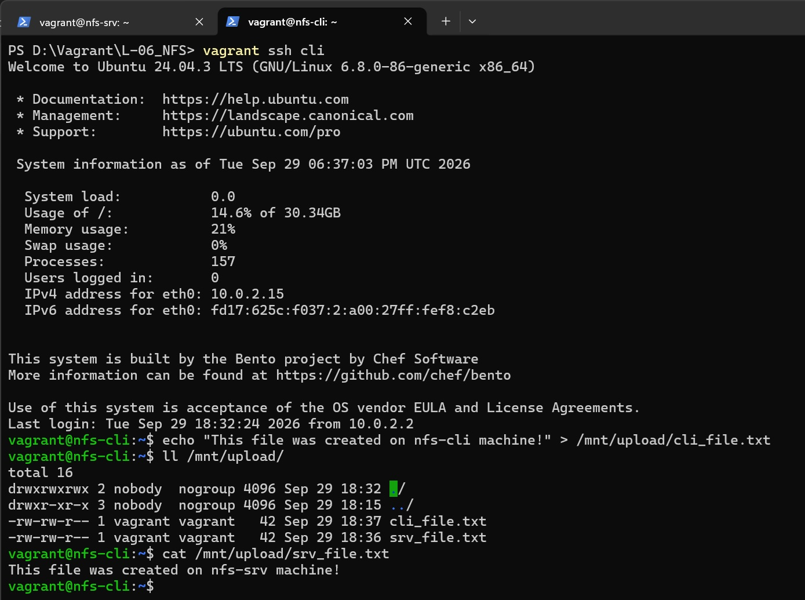
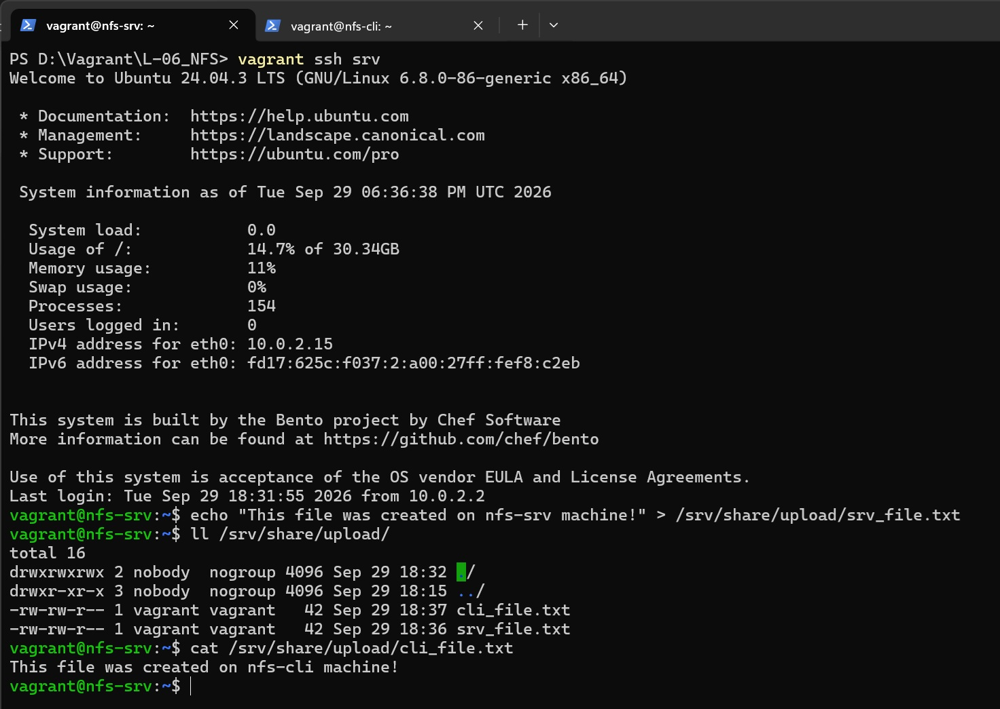
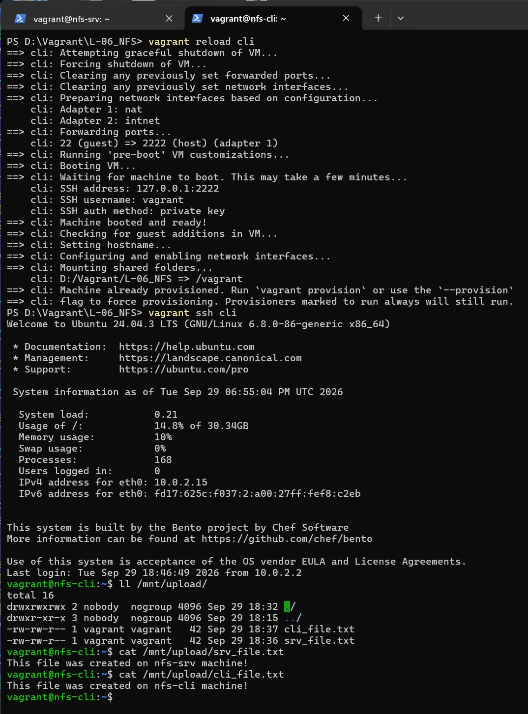
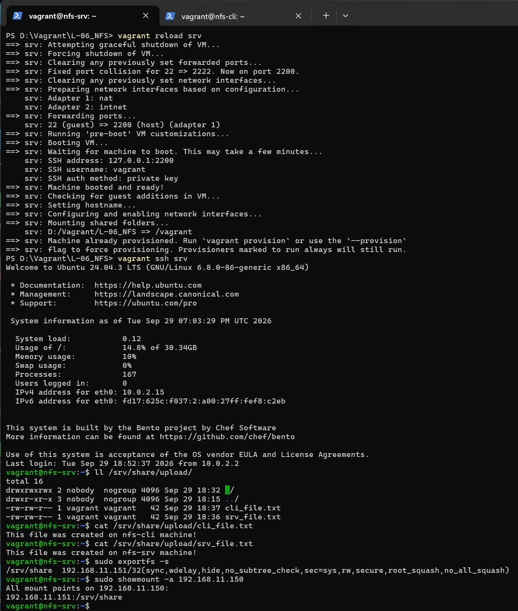
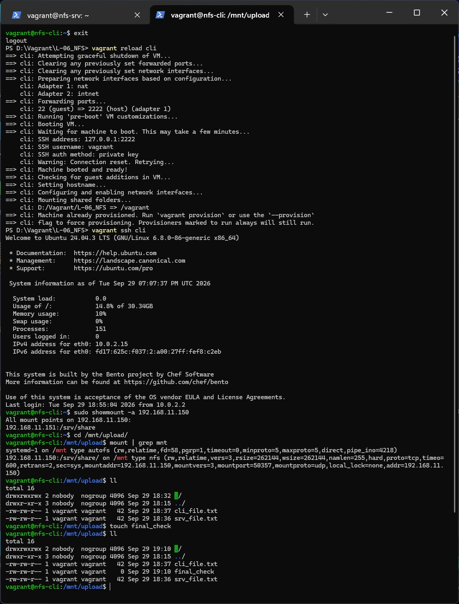
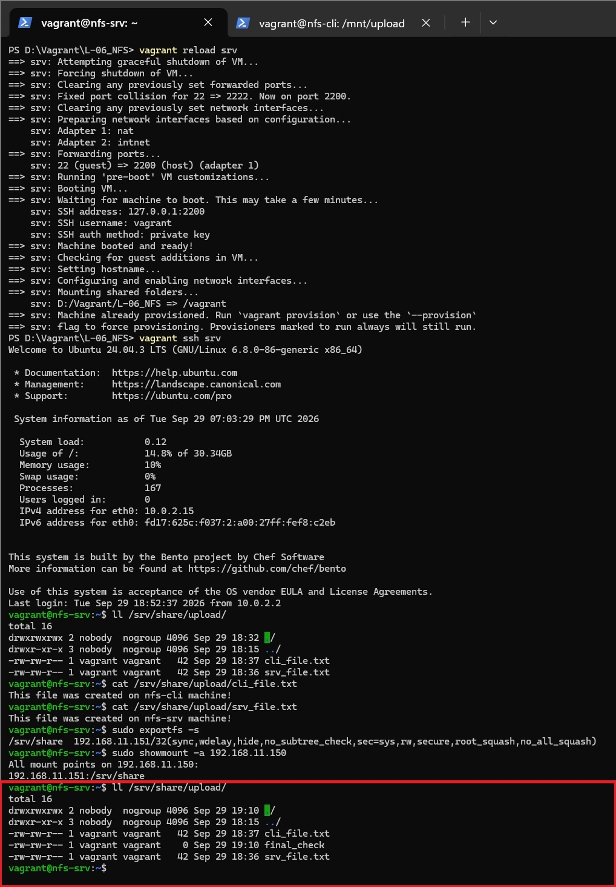

# Домашнее задание
##  Работа с NFS
### Задание

- запустить 2 виртуальных машины (сервер NFS и клиента);
- на сервере NFS должна быть подготовлена и экспортирована директория;
- в экспортированной директории должна быть поддиректория с именем upload с правами на запись в неё;
- экспортированная директория должна автоматически монтироваться на клиенте при старте виртуальной машины (systemd, autofs или fstab — любым способом);
- монтирование и работа NFS на клиенте должна быть организована с использованием NFSv3.

## Решение

### Vagrant 2.4.9, VirtualBox 7.2.16, на хосте с ОС Windows 11

[Vagrantfile](Vagrantfile) файл создает 2 ВМ с гостевой ОС bento/ubuntu-24.04 со следующими параметрами:
* ОЗУ 2048Мб, CPU 2;
* выполняет провижинг:
  * для сервера [nfs-srv.sh](nfs-srv.sh)
  * для клиента [nfs-cli.sh](nfs-cli.sh)

После выполнения сценария Vagrantfile зайдем на сервер - ВМ srv (nfs-srv) и создадим на шаре в аплоаде (/srv/share/upload) файл srv_file.txt, затем зайдем на клиента ВМ cli (nfs-cli) и создадим в подмонтированной в /mnt NFS-папке файл cli_file.txt, выведем ее содержимое и содержимое файла, созданного на сервере /srv/share/upload

Переключимся на сервер, выведем содержимое общей папки и файла, созданного на клиенте cli_file.txt

Перезагружаем клиента, заходим на клиента, проверяем содержимое общей папки и файлов

Перезагружаем сервер, заходим на сервер, проверяем файлы в общей папке, проверяем экспорты exportfs -s, проверяем работу RPC showmount -a

Перезагружаеи клиента, заходим на клиента, проверяем работу RPC showmount -a, заходим в общую папку, проверяем статус монтирования mount | grep mnt, проверяем наличие ранее созданных файлов, создаём тестовый файл touch final_check, проверяем, что файл успешно создан

Проверяем на сервере (новая проверка в красном прямоугольнике, остальное - содержание предыдущей проверки на сервере)

