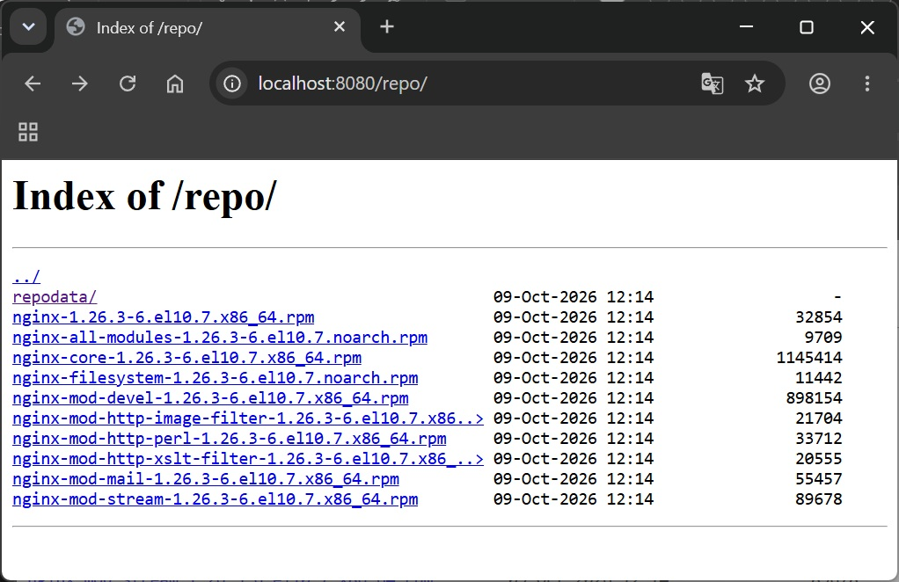
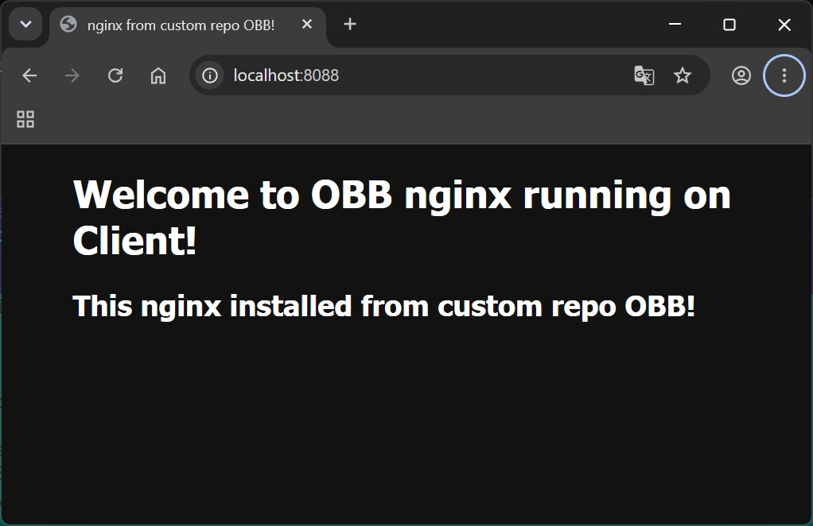
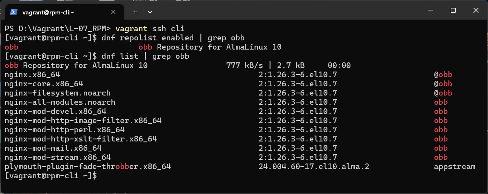

# Домашнее задание
##  Сборка RPM-пакета и создание репозитория
### Задание

- создать свой RPM (можно взять свое приложение, либо собрать к примеру Apache с определенными опциями);
- создать свой репозиторий и разместить там ранее собранный RPM;
- реализовать это все либо в Vagrant, либо развернуть у себя через Nginx и дать ссылку на репозиторий.

## Решение

### Vagrant 2.4.9, VirtualBox 7.2.16, на хосте с ОС Windows 11

[Vagrantfile](Vagrantfile) файл создает 2 ВМ с гостевой ОС almalinux/10 со следующими параметрами:
* ОЗУ 2048Мб, CPU 2;
* выполняет провижинг:
  * для сервера [rpm-srv.sh](rpm-srv.sh)
    * пробрасывет пор 8080 с хоста на 80 гостя;
    * устанавливаем набор софта для самостоятельной сборки пакета;
    * создает кастомный rpm пакет nginx c включенной по умолчанию опцией autoindex on и содержащий модуль ngx_brotli;
    * устанавливает nginx из кастомного пакета;
    * создает свой репозиторий;
  * для клиента [rpm-cli.sh](rpm-cli.sh)
    * пробрасывет пор 8088 с хоста на 80 гостя;
    * добавляет свой репозиторий, расположенный на сервере;
    * устанавливает ngix из своего репозитория, а зависимости из официального;
    * изменяет дефолтную страницу nginx.

После выполнения сценарияпосмотрим содержимое репозитория на сервере [http://localhost:8080/repo/](http://localhost:8080/repo/)



убедимся что на клиенте работает nginx [http://localhost:8088](http://localhost:8088)



```bash
vagrant ssh cli

dnf repolist enabled | grep obb

dnf list | grep obb
```

список пакетов в кастомном репозитории на клиенте



