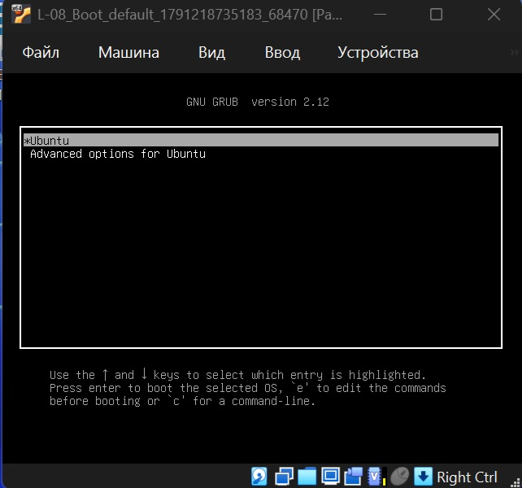
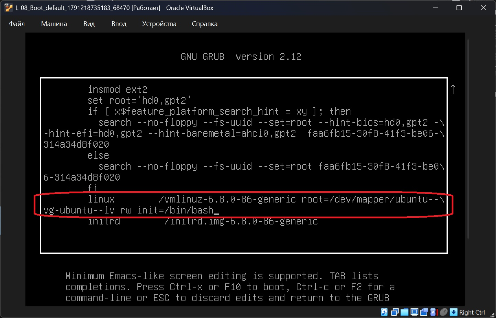
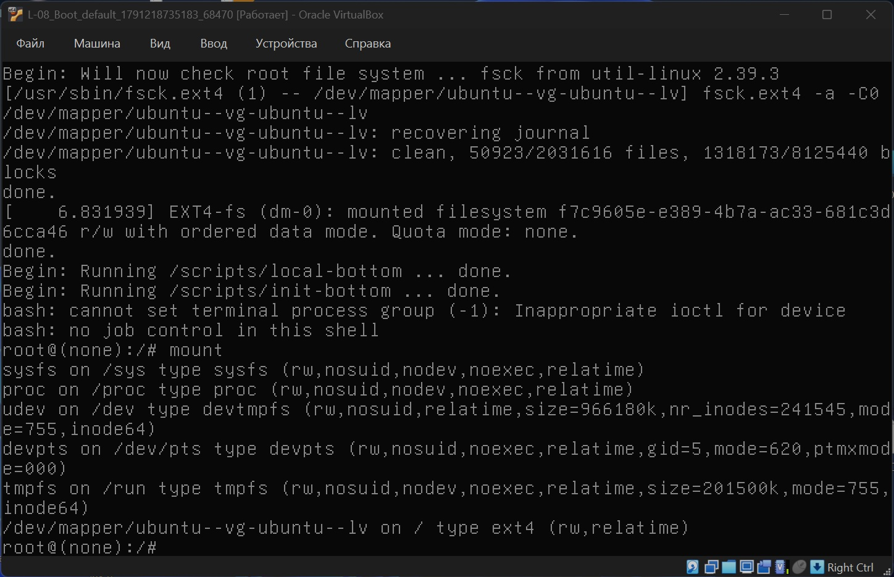
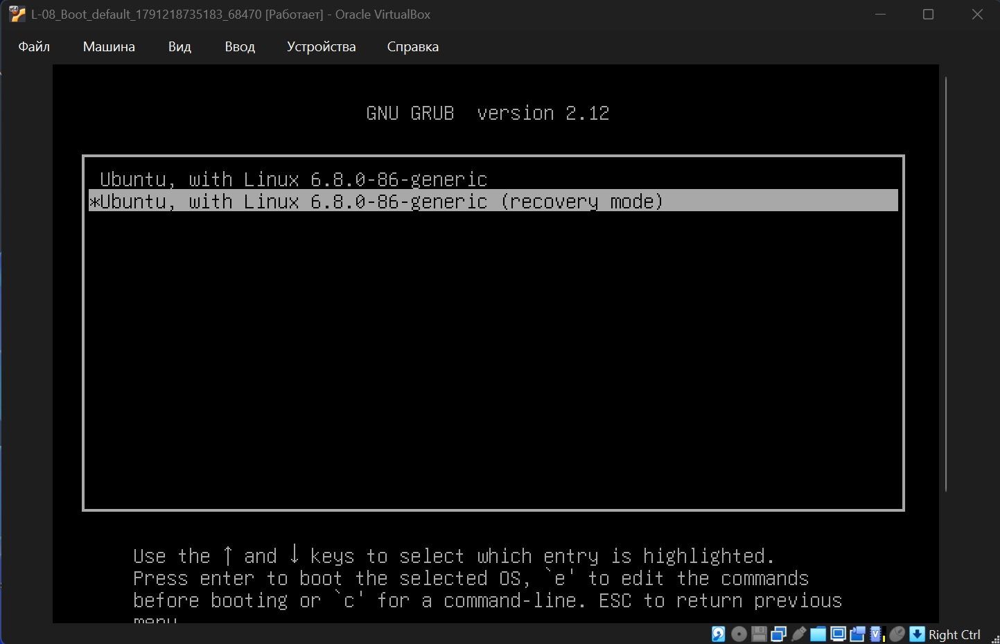
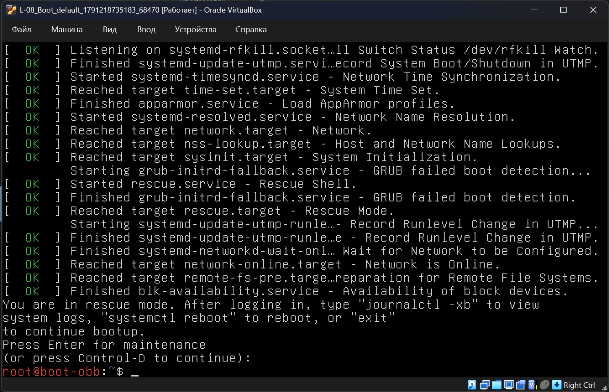
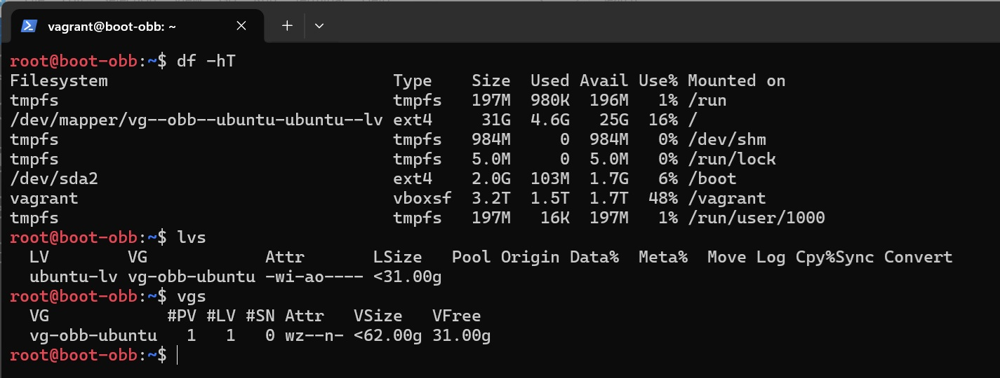

# Домашнее задание
##  Работа с загрузчиком
### Задание
1) Включить отображение меню Grub.
2) Попасть в систему без пароля несколькими способами.
3) Установить систему с LVM, после чего переименовать VG.

## Решение

### Vagrant 2.4.9, VirtualBox 7.2.16, на хосте с ОС Windows 11

Vagrant файл создает ВМ с гостевой ОС bento/ubuntu-24.04 со следующими параметрами:
* ОЗУ 2048Мб, CPU 2;

### Включить отображение меню Grub.

Настраиваем GRUB

Для выбора ядра при загрузке, правим конфиг grub: изменим GRUB_TIMEOUT_STYLE с hidden на menu, значение таймаута при выборе версии ядра на 10с: GRUB_TIMEOUT=10

```bash
echo -e '\n# OBB: to show grub menu, change the value from hidden to menu' \
        '\nGRUB_TIMEOUT_STYLE=menu' \
        '\n# OBB: to display the menu for 10 sec., change the value from 0 to 10 sec' \
        '\nGRUB_TIMEOUT=10' \
        '\n' | sudo tee -a /etc/default/grub


# Обновим конфигурацию загрузчика
sudo update-grub
Sourcing file '/etc/default/grub'
Generating grub configuration file ...
Found linux image: /boot/vmlinuz-6.8.0-86-generic
Found initrd image: /boot/initrd.img-6.8.0-86-generic
Warning: os-prober will not be executed to detect other bootable partitions.
Systems on them will not be added to the GRUB boot configuration.
Check GRUB_DISABLE_OS_PROBER documentation entry.
Adding boot menu entry for UEFI Firmware Settings ...
done

# Перезагружаемся
sudo reboot
```

Теперь при загрузке отображается меню загрузчика GRUB



### Попасть в систему без пароля несколькими способами.

Выбираем Ubuntu и жмем `e` для редактирования параметров загрузки, правим параметры загрузки ядра: 
 * монтировать корневую файловую систему в режиме для записи (меняем ro на rw) 
 * указываем операционной системе запустить командную оболочку Bash (/bin/bash) в качестве самого первого и главного процесса (PID 1) сразу после инициализации ядра Linux, полностью минуя стандартную систему инициализации (systemd): init=/bin/bash



жмем Ctrl+X или F10 для загрузки. Мы попали в систему без пароля:



Альтернативный способ попастьв систему без пароля - выбрать другой пункт меня загрузки GRUB - "Advanced options for Ubuntu" и зайти в режим восстановления:



Мы попали в систему без пароля:



### Установить систему с LVM, после чего переименовать VG

Штатным образом Ubuntu 24.04 уже устанавливаетя на LVM

```bash
sudo -i

# Корневая система на LVM: том ubuntu-lv в группе ubuntu-vg
root@boot-obb:~$ df -hT
Filesystem                        Type    Size  Used Avail Use% Mounted on
tmpfs                             tmpfs   197M  980K  196M   1% /run
/dev/mapper/ubuntu--vg-ubuntu--lv ext4     31G  4.5G   25G  16% /
tmpfs                             tmpfs   984M     0  984M   0% /dev/shm
tmpfs                             tmpfs   5.0M     0  5.0M   0% /run/lock
/dev/sda2                         ext4    2.0G  103M  1.7G   6% /boot
vagrant                           vboxsf  3.2T  1.5T  1.7T  48% /vagrant
tmpfs                             tmpfs   197M   16K  197M   1% /run/user/1000

# Список логических томов
root@boot-obb:~$ lvs
  LV        VG        Attr       LSize   Pool Origin Data%  Meta%  Move Log Cpy%Sync Convert
  ubuntu-lv ubuntu-vg -wi-ao---- <31.00g

# Список групп
root@boot-obb:~$ vgs
  VG        #PV #LV #SN Attr   VSize   VFree
  ubuntu-vg   1   1   0 wz--n- <62.00g 31.00g

# Переименуем группу
root@boot-obb:~$ vgrename ubuntu-vg vg-obb-ubuntu
  Volume group "ubuntu-vg" successfully renamed to "vg-obb-ubuntu"

# Для успешной загрузки системы необходимо изменить имя группы в конфигурации загрузчика GRUB

```bash
root@boot-obb:~$ nano /boot/grub/grub.cfg
# Ищем: /dev/mapper/ubuntu--vg-ubuntu--lv
# заменяем на: /dev/mapper/vg--obb--ubuntu-ubuntu--lv
# сохраняем изменения и перезагружаемся
```

После перезагрузки проверяем что имя группы изменилось




