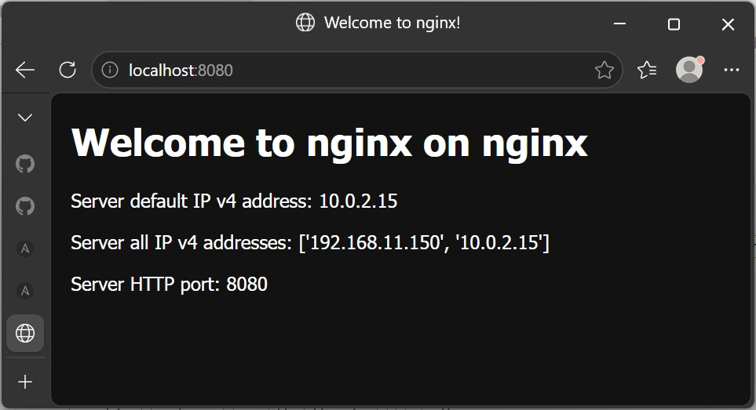
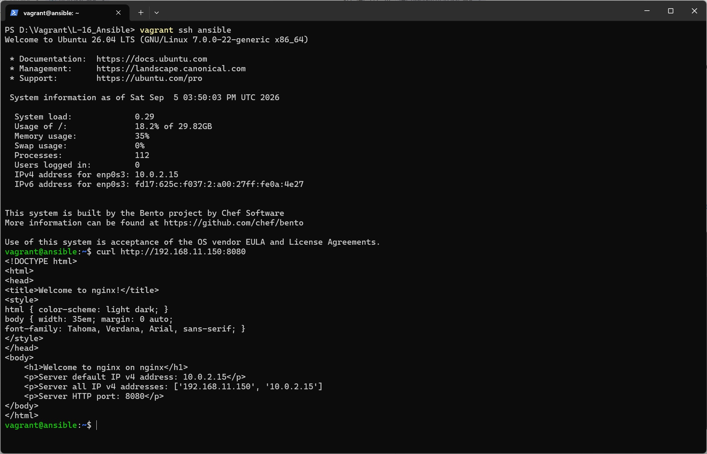

# Домашнее задание
##  Автоматизация администрирования. Ansible
 
### Vagrant 2.4.9, VirtualBox 7.2.16, на хосте с ОС Windows 11

Т.к. хостовая ОС Windows 11 без WSL, нам потребуется дополнительная  виртуальная машина, на которой будет развернут ansible. 

Vagrant файл создает две VM с гостевой ОС bento/ubuntu-26.04 со следующими параметрами:
* ОЗУ 768Мб, CPU 1;
* ВМ nginx:
  * проброс портов с хоста 8080 на гостевую 8080
* ВМ ansible:
  * подключает общую папку с плэйбуком для установки nginx на вм nginx
  * выполняет прожинг:
    * копирует закрытый ключ для доступа к вм nginx
    * создает и настраиваем папку для работы с плэйбуком
    * устанавливает ansible
    * запускает плэйбук для установки nginx на вм nginx

После выполнения сценария Vagrantfile с хостовой машини по адресу [http://localhost:8080](http://localhost:8080) будет доступна демострационная страница, отданная вм nginx:



так же эта страница доступна и с вм ansible по адресу 192.168.11.150:8080

```bash
curl http://192.168.11.150:8080
```

