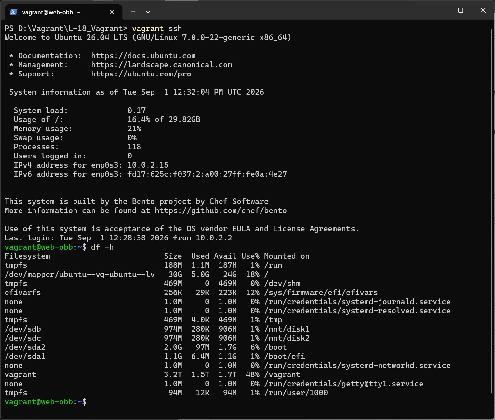
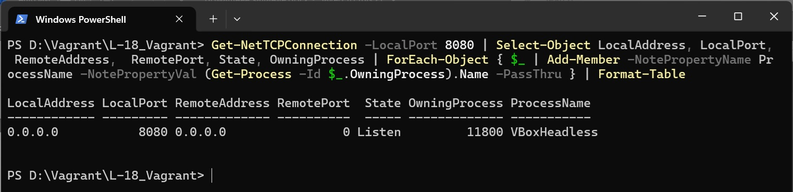
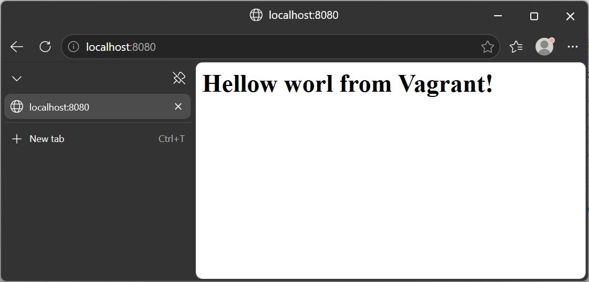

# Домашнее задание
##  Vagrant. Расширенная настройка дисков и сетей
 
### Vagrant 2.4.9, VirtualBox 7.2.16, на хосте с ОС Windows 11

Vagrant файл создает VM с гостевой ОС bento/ubuntu-26.04 со следующими параметрами:
* ОЗУ 1024Мб, CPU 2;
* дополнительные диски 2 по 1Гб;
* проброс портов 8080 с хоста на 80 гостевой ОС

выполняет провижинг:
* форматирует добавленные диски в файловую систему ext4;
* создает точки монтирования /mnt/disk1 и /mnt/disk2;
* монтирует диски в указанные директории (reboot после добавления в fstab);
* добавляет записи в /etc/fstab для автоматического монтирования при загрузке.

Весь провижинг выполнен на SHELL'е, т.к. Windows не дружит c Ansible.

Скриншот вывода команды df -h

Скриншот с хостовой машины вывода команды netstat -tulpn | grep 8080 с запущенной ВМ заменен аналогом PS в Windows:

Get-NetTCPConnection -LocalPort 8080 | Select-Object LocalAddress, LocalPort, RemoteAddress,  RemotePort, State, OwningProcess | ForEach-Object { $_ | Add-Member -NotePropertyName ProcessName -NotePropertyVal (Get-Process -Id $_.OwningProcess).Name -PassThru } | Format-Table

Скриншот с хоста http://localhost:8080/

