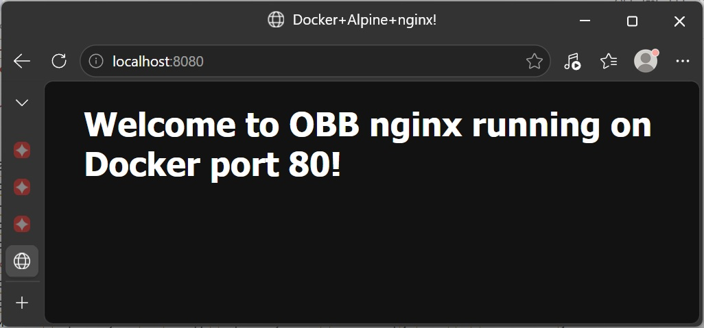
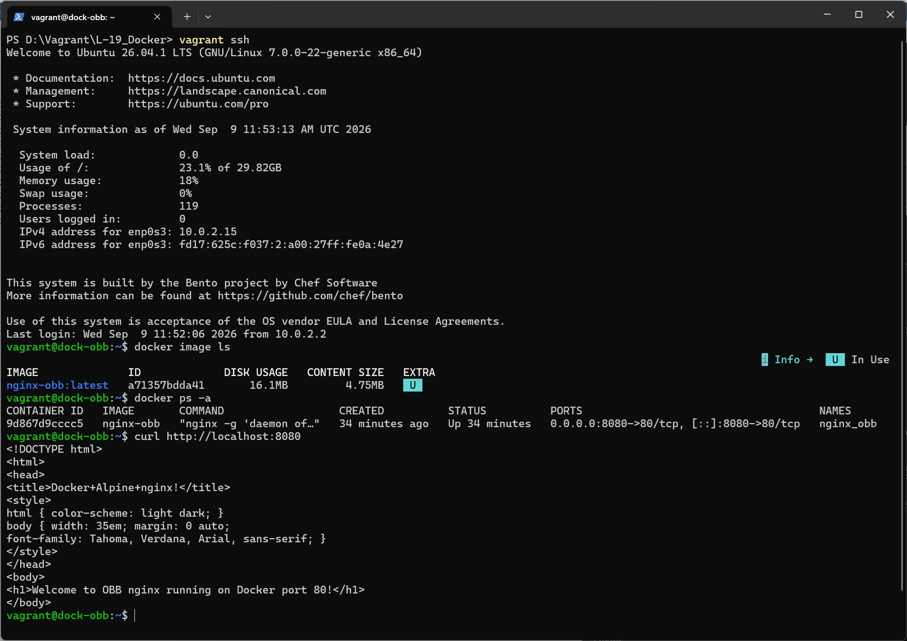

# Домашнее задание
##  Docker: основы работы с контейнеризацией 
 ## Задание
* Установите Docker на хост машину https://docs.docker.com/engine/install/ubuntu/
* Установите Docker Compose - как плагин, или как отдельное приложение
* Создайте свой кастомный образ nginx на базе alpine. После запуска nginx должен отдавать кастомную страницу (достаточно изменить дефолтную страницу nginx)
* Определите разницу между контейнером и образом
* Вывод опишите в домашнем задании.
* Ответьте на вопрос: Можно ли в контейнере собрать ядро?

## Решение

### Vagrant 2.4.9, VirtualBox 7.2.16, на хосте с ОС Windows 11

Vagrant файл создает ВМ с гостевой ОС bento/ubuntu-26.04 со следующими параметрами:
* ОЗУ 2048Мб, CPU 2;
* проброс портов с хоста 8080 на гостевую 8080;
* выполняет прожинг:
    * копирует Dockerfile, конфиг nginx и измененный index.html;
    * устанавливает Docker согласно инструкции из официальной документации [Install Docker Engine on Ubuntu](https://docs.docker.com/engine/install/ubuntu/)
    * создает кастомный образ nginx на базе alpine (nginx-obb)
    * создает и запускает контейнер nginx_obb из кастомного образа nginx-obb с политикой перезапуска - всегда перезапускать контейнер, если он остановлен;

После выполнения сценария Vagrantfile с хостовой машини по адресу [http://localhost:8080](http://localhost:8080) будет доступна демострационная страница, отданная nginx из контейнера Doсker:



так же эта страница доступна и с вм по адресу http://localhost:8080

```bash
docker image ls
docker ps -a
curl http://localhost:8080
```


### Разместим образ на Docker hub

```bash

# Список образов
docker image ls

IMAGE              ID             DISK USAGE   CONTENT SIZE   EXTRA
nginx-obb:latest   b91bd1426313       16.1MB         4.75MB    U

# Добавим к нашему образу тэг имя_пользователя/имя_репозитория:тэг
docker tag nginx-obb barolbor/nginx-obb:latest

# Проверим
docker image ls

IMAGE                       ID             DISK USAGE   CONTENT SIZE   EXTRA
barolbor/nginx-obb:latest   b91bd1426313       16.1MB         4.75MB    U
nginx-obb:latest            b91bd1426313       16.1MB         4.75MB    U

# Подключимся к Docker хабу
docker login --username barolbor

# Разместим образ на Docker хабе
docker push barolbor/nginx-obb:latest
The push refers to repository [docker.io/barolbor/nginx-obb]
44136fa355b3: Pushed
19697a3dd18b: Pushed
55afa1ecc21d: Pushed
6acd3aa3345c: Pushed
6107edcde33e: Pushed
416c33d0479e: Pushed
latest: digest: sha256:b91bd1426313f0c6dcfa16a2bd245e77e84a2d025b95660e70ccd27413cb18ee size: 856
```

После загрузки образ доступен по адресу: [https://hub.docker.com/repository/docker/barolbor/nginx-obb/general](https://hub.docker.com/repository/docker/barolbor/nginx-obb/general)


### Разница между образом и контейнером:

Главное отличие заключается в том, что образ — это неизменяемый шаблон (класс — код и структура) | (программа), а контейнер — это запущенный экземпляр этого шаблона (объект — экземпляр класса в памяти) | (процесс).

**Образ** — это статический шаблон/фундамент, содержащий все необходимое для запуска приложения. Он состоит из нескольких слоев OverlayFS "только для чтения" (Read-Only). В нем запечатаны операционная система, библиотеки, зависимости, код приложения и настройки, но не ядро. Образ неизменяем, на его основе можно создавать множество контейнеров.

**Контейнер** — это запущенный экземпляр образа: образ + Runtime Read-Write layer. Он запускается в изолированной среде с собственным файловым пространством, сетевой средой, процессами, но использует ядро хостовой ОС. Это обычный процесс в Linux, но с применением механизмов изоляции (namespaces, cgroups). Данные внутри контейнера временные и удаляются вместе с контейнером.

### Можно ли в контейнере собрать ядро?

Да, собрать ядро Linux внутри Docker-контейнера можно.

Контейнер предоставляет изолированное окружение со всеми необходимыми компиляторами (gcc, clang), утилитами (make, bc, bison, flex) и библиотеками. Это гарантирует, что сборка пройдет одинаково на любой машине (Ubuntu, macOS или Windows), где установлен Docker, и не «засорит» основную систему зависимостями.

Но есть ньюансы:

1. Собрать ≠ Запустить. Сборка/Компиляция: Контейнеру для этого нужны только ресурсы процессора и оперативной памяти. На выходе будет готовый файл ядра и модули, которые можно запаковать в .deb/.rpm пакет или установить на реальную машину/виртуальную машину. Но внутри контейнера не получиться выполнить перезагрузку и загрузиться в собранное ядро, т.к. контейнер не имеет собственного ядра, а использует ядро хоста.

2. Ограничения при компиляции. Обычно сборка ядра внутри контейнера проходит без прав суперпользователя, но если на этапе сборки или тестирования модулей потребуется напрямую взаимодействовать с железными компонентами хоста (например, для сборки специфичных драйверов), контейнер нужно запускать со специальным флагом --privileged, который дает контейнеру доступ к устройствам хоста.

