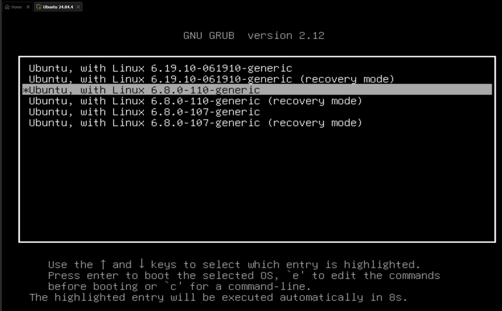

# Домашнее задание
##  Обновление ядра системы
 
### Ubuntu 22.04.4 LTS в WMware на хосте с ОС Windows 11

Определим текущую версию ядра и архитектуру машины

```bash
# Версия ядра
uname -r
6.8.0-107-generic

# Архитектура процессора
 uname -p
x86_64
```
Основные сборки см. https://wiki.ubuntu.com/Kernel/MainlineBuilds

В архиве ядра основной ветки Ubuntu, отсортированом по дате последней сборки, https://kernel.ubuntu.com/mainline/?C=N;O=D найдем свежую версию ядра (6.19.11) и скачаем ее для нашей архитектуры.

```bash
# Создадим папку для пакетов ядра
mkdir -p kernels/deb

# Скачаем пакеты
wget -P ~/kernels/deb/ https://kernel.ubuntu.com/mainline/v6.19.11/amd64/linux-headers-6.19.11-061911-generic_6.19.11-061911.202604021147_amd64.deb

wget -P ~/kernels/deb/ https://kernel.ubuntu.com/mainline/v6.19.11/amd64/linux-headers-6.19.11-061911_6.19.11-061911.202604021147_all.deb

wget -P ~/kernels/deb/ https://kernel.ubuntu.com/mainline/v6.19.11/amd64/linux-image-unsigned-6.19.11-061911-generic_6.19.11-061911.202604021147_amd64.deb

wget -P ~/kernels/deb/ https://kernel.ubuntu.com/mainline/v6.19.11/amd64/linux-modules-6.19.11-061911-generic_6.19.11-061911.202604021147_amd64.deb


```

Проверим бинарные файлы основной сборки согласно инструкции https://wiki.ubuntu.com/Kernel/MainlineBuilds#Verifying_mainline_build_binaries

```bash
# Импортируем открытый ключ официальной командsы разработчиков ядра в свою связку ключей
gpg --keyserver hkps://pgp.mit.edu --recv-key "60AA7B6F30434AE68E569963E50C6A0917C622B0"
gpg: directory '/home/sa2/.gnupg' created
gpg: keybox '/home/sa2/.gnupg/pubring.kbx' created
gpg: /home/sa2/.gnupg/trustdb.gpg: trustdb created
gpg: key E50C6A0917C622B0: public key "Kernel PPA <kernel-ppa@canonical.com>" imported
gpg: Total number processed: 1
gpg:               imported: 1

# Загрузим файлы CHECKSUMS и CHECKSUMS.gpg из каталога сборки и проверим, подписан ли файл CHECKSUMS этим ключом:

wget -P ~/kernels/deb/ https://kernel.ubuntu.com/mainline/v6.19.11/amd64/CHECKSUMS

wget -P ~/kernels/deb/ https://kernel.ubuntu.com/mainline/v6.19.11/amd64/CHECKSUMS.gpg

cd ~/kernels/deb/

gpg --verify CHECKSUMS.gpg CHECKSUMS
gpg: Signature made Thu 02 Apr 2026 02:35:34 PM UTC
gpg:                using RSA key 60AA7B6F30434AE68E569963E50C6A0917C622B0
gpg: Good signature from "Kernel PPA <kernel-ppa@canonical.com>" [unknown]
gpg: WARNING: This key is not certified with a trusted signature!
gpg:          There is no indication that the signature belongs to the owner.
Primary key fingerprint: 60AA 7B6F 3043 4AE6 8E56  9963 E50C 6A09 17C6 22B0

# Проверим контрольные суммы загруженных deb-файлов. Для каждого загруженного deb-файла и каждого типа контрольных сумм, указанных в файле CHECKSUMS, должна отображаться строка, заканчивающаяся на "OK":

shasum -c CHECKSUMS 2>&1 | grep 'OK$'
linux-headers-6.19.11-061911-generic_6.19.11-061911.202604021147_amd64.deb: OK
linux-headers-6.19.11-061911_6.19.11-061911.202604021147_all.deb: OK
linux-image-unsigned-6.19.11-061911-generic_6.19.11-061911.202604021147_amd64.deb: OK
linux-modules-6.19.11-061911-generic_6.19.11-061911.202604021147_amd64.deb: OK
linux-headers-6.19.11-061911-generic_6.19.11-061911.202604021147_amd64.deb: OK
linux-headers-6.19.11-061911_6.19.11-061911.202604021147_all.deb: OK
linux-image-unsigned-6.19.11-061911-generic_6.19.11-061911.202604021147_amd64.deb: OK
linux-modules-6.19.11-061911-generic_6.19.11-061911.202604021147_amd64.deb: OK
```

Установим все файлы ядра, скачанные из основного репозитория.

```bash
sudo dpkg -i *.deb 
Selecting previously unselected package linux-headers-6.19.11-061911.
(Reading database ... 166945 files and directories currently installed.)
Preparing to unpack linux-headers-6.19.11-061911_6.19.11-061911.202604021147_all.deb ...
Unpacking linux-headers-6.19.11-061911 (6.19.11-061911.202604021147) ...
Selecting previously unselected package linux-headers-6.19.11-061911-generic.
Preparing to unpack linux-headers-6.19.11-061911-generic_6.19.11-061911.202604021147_amd64.deb ...
Unpacking linux-headers-6.19.11-061911-generic (6.19.11-061911.202604021147) ...
Selecting previously unselected package linux-image-unsigned-6.19.11-061911-generic.
Preparing to unpack linux-image-unsigned-6.19.11-061911-generic_6.19.11-061911.202604021147_amd64.deb ...
run-parts: missing operand
Try `run-parts --help' for more information.
dpkg: error processing archive linux-image-unsigned-6.19.11-061911-generic_6.19.11-061911.202604021147_amd64.deb (--install):
 new linux-image-unsigned-6.19.11-061911-generic package pre-installation script subprocess returned error exit status 1
run-parts: missing operand
Try `run-parts --help' for more information.
dpkg: error while cleaning up:
 new linux-image-unsigned-6.19.11-061911-generic package post-removal script subprocess returned error exit status 1
Selecting previously unselected package linux-modules-6.19.11-061911-generic.
Preparing to unpack linux-modules-6.19.11-061911-generic_6.19.11-061911.202604021147_amd64.deb ...
Unpacking linux-modules-6.19.11-061911-generic (6.19.11-061911.202604021147) ...
Setting up linux-headers-6.19.11-061911 (6.19.11-061911.202604021147) ...
Setting up linux-headers-6.19.11-061911-generic (6.19.11-061911.202604021147) ...
dpkg: dependency problems prevent configuration of linux-modules-6.19.11-061911-generic:
 linux-modules-6.19.11-061911-generic depends on linux-main-modules-zfs-6.19.11-061911-generic; however:
  Package linux-main-modules-zfs-6.19.11-061911-generic is not installed.

dpkg: error processing package linux-modules-6.19.11-061911-generic (--install):
 dependency problems - leaving unconfigured
Errors were encountered while processing:
 linux-image-unsigned-6.19.11-061911-generic_6.19.11-061911.202604021147_amd64.deb
 linux-modules-6.19.11-061911-generic
```

В процессе установки пакета "linux-image-unsigned-6.19.11-061911-generic" произошла ошибка: "package pre-installation script subprocess returned error exit status 1. run-parts: missing operand". 

Посмотрим состояние этого пакета

```bash
dpkg-query -l  linux-image-unsigned-6.19.11-061911-generic
Desired=Unknown/Install/Remove/Purge/Hold
| Status=Not/Inst/Conf-files/Unpacked/halF-conf/Half-inst/trig-aWait/Trig-pend
|/ Err?=(none)/Reinst-required (Status,Err: uppercase=bad)
||/ Name                                        Version                     Architecture Description
+++-===========================================-===========================-============-=================================
iHR linux-image-unsigned-6.19.11-061911-generic 6.19.11-061911.202604021147 amd64        (no description available)
```

Пакет с флагом reinstreq поврежден и требует переустановки. Это пакеты нельзя удалить, только принудительно с опцией --force.

Произошедшая ошибка и статус пакета свидетельствуют о проблеме в самом deb пакете. 

Удалим все установленные пакеты ядра 6.19.11.

```bash
# Выведем список пакетов ядра 6.19.11
apt list --installed | grep 6.19.11

WARNING: apt does not have a stable CLI interface. Use with caution in scripts.

linux-headers-6.19.11-061911-generic/now 6.19.11-061911.202604021147 amd64 [installed,local]
linux-headers-6.19.11-061911/now 6.19.11-061911.202604021147 all [installed,local]
linux-image-unsigned-6.19.11-061911-generic/now 6.19.11-061911.202604021147 amd64 [installed,local]
linux-modules-6.19.11-061911-generic/now 6.19.11-061911.202604021147 amd64 [installed,local]

dpkg -l '*6.19.11*'
Desired=Unknown/Install/Remove/Purge/Hold
| Status=Not/Inst/Conf-files/Unpacked/halF-conf/Half-inst/trig-aWait/Trig-pend
|/ Err?=(none)/Reinst-required (Status,Err: uppercase=bad)
||/ Name                                          Version                     Architecture Description
+++-=============================================-===========================-============-====================================================
ii  linux-headers-6.19.11-061911                  6.19.11-061911.202604021147 all          Header files related to Linux kernel version 6.19.11
ii  linux-headers-6.19.11-061911-generic          6.19.11-061911.202604021147 amd64        Linux kernel headers for version 6.19.11
iHR linux-image-unsigned-6.19.11-061911-generic   6.19.11-061911.202604021147 amd64        (no description available)
un  linux-main-modules-zfs-6.19.11-061911-generic <none>                      <none>       (no description available)
iU  linux-modules-6.19.11-061911-generic          6.19.11-061911.202604021147 amd64        Linux kernel modules for version 6.19.11


# Удалим пакеты ядра 6.19.11
sudo dpkg --remove linux-modules-6.19.11-061911-generic
(Reading database ... 207516 files and directories currently installed.)
Removing linux-modules-6.19.11-061911-generic (6.19.11-061911.202604021147) ...

sudo dpkg --remove linux-headers-6.19.11-061911-generic
(Reading database ... 199359 files and directories currently installed.)
Removing linux-headers-6.19.11-061911-generic (6.19.11-061911.202604021147) ...

sudo dpkg --remove linux-headers-6.19.11-061911
(Reading database ... 188413 files and directories currently installed.)
Removing linux-headers-6.19.11-061911 (6.19.11-061911.202604021147) ...

# Принудительно удалим поврежденный пакет с опцией --force
sudo dpkg --force-all --purge linux-image-unsigned-6.19.11-061911-generic
dpkg: warning: overriding problem because --force enabled:
dpkg: warning: package is in a very bad inconsistent state; you should
 reinstall it before attempting a removal
(Reading database ... 166945 files and directories currently installed.)
Removing linux-image-unsigned-6.19.11-061911-generic (6.19.11-061911.202604021147) ...

# Обновим базу данных пакетов системы, выполним полное обновление системы и удаляим ненужные файлы.
sudo apt update && sudo apt full-upgrade && sudo apt autoremove && sudo apt autoclean
Hit:1 http://ru.archive.ubuntu.com/ubuntu noble InRelease
Hit:2 http://security.ubuntu.com/ubuntu noble-security InRelease
Hit:3 http://ru.archive.ubuntu.com/ubuntu noble-updates InRelease
Hit:4 http://ru.archive.ubuntu.com/ubuntu noble-backports InRelease
Reading package lists... Done
Building dependency tree... Done
Reading state information... Done
All packages are up to date.
Reading package lists... Done
Building dependency tree... Done
Reading state information... Done
Calculating upgrade... Done
0 upgraded, 0 newly installed, 0 to remove and 0 not upgraded.
Reading package lists... Done
Building dependency tree... Done
Reading state information... Done
0 upgraded, 0 newly installed, 0 to remove and 0 not upgraded.
Reading package lists... Done
Building dependency tree... Done
Reading state information... Done
```

Скачаем и установим предыдущую версию ядря 6.19.10

```bash
mkdir ~/kernels/deb/6.19.10/

# Скачиваем пакеты ядра
wget -P ~/kernels/deb/6.19.10/ https://kernel.ubuntu.com/mainline/v6.19.10/amd64/linux-headers-6.19.10-061910-generic_6.19.10-061910.202603251147_amd64.deb
wget -P ~/kernels/deb/6.19.10/ https://kernel.ubuntu.com/mainline/v6.19.10/amd64/linux-headers-6.19.10-061910_6.19.10-061910.202603251147_all.deb
wget -P ~/kernels/deb/6.19.10/ https://kernel.ubuntu.com/mainline/v6.19.10/amd64/linux-image-unsigned-6.19.10-061910-generic_6.19.10-061910.202603251147_amd64.deb
wget -P ~/kernels/deb/6.19.10/ https://kernel.ubuntu.com/mainline/v6.19.10/amd64/linux-modules-6.19.10-061910-generic_6.19.10-061910.202603251147_amd64.deb

# Скачиваем файлы для проверки контрольных сумм
wget -P ~/kernels/deb/6.19.10/ https://kernel.ubuntu.com/mainline/v6.19.10/amd64/CHECKSUMS
wget -P ~/kernels/deb/6.19.10/ https://kernel.ubuntu.com/mainline/v6.19.10/amd64/CHECKSUMS.gpg

# Проверим подпись файла CHECKSUMS:
gpg --verify CHECKSUMS.gpg CHECKSUMS
gpg: Signature made Wed 25 Mar 2026 02:26:10 PM UTC
gpg:                using RSA key 60AA7B6F30434AE68E569963E50C6A0917C622B0
gpg: Good signature from "Kernel PPA <kernel-ppa@canonical.com>" [unknown]
gpg: WARNING: This key is not certified with a trusted signature!
gpg:          There is no indication that the signature belongs to the owner.
Primary key fingerprint: 60AA 7B6F 3043 4AE6 8E56  9963 E50C 6A09 17C6 22B0

# Проверим контрольные суммы загруженных deb-файлов. Для каждого загруженного deb-файла и каждого типа контрольных сумм, указанных в файле CHECKSUMS, должна отображаться строка, заканчивающаяся на "OK":
shasum -c CHECKSUMS 2>&1 | grep 'OK$'
linux-headers-6.19.10-061910-generic_6.19.10-061910.202603251147_amd64.deb: OK
linux-headers-6.19.10-061910_6.19.10-061910.202603251147_all.deb: OK
linux-image-unsigned-6.19.10-061910-generic_6.19.10-061910.202603251147_amd64.deb: OK
linux-modules-6.19.10-061910-generic_6.19.10-061910.202603251147_amd64.deb: OK
linux-headers-6.19.10-061910-generic_6.19.10-061910.202603251147_amd64.deb: OK
linux-headers-6.19.10-061910_6.19.10-061910.202603251147_all.deb: OK
linux-image-unsigned-6.19.10-061910-generic_6.19.10-061910.202603251147_amd64.deb: OK
linux-modules-6.19.10-061910-generic_6.19.10-061910.202603251147_amd64.deb: OK

# Устанавливаем пакеты ядра 6.19.10
sudo dpkg -i linux-headers-6.19.10-061910_6.19.10-061910.202603251147_all.deb
[sudo] password for sa2:
Selecting previously unselected package linux-headers-6.19.10-061910.
(Reading database ... 158785 files and directories currently installed.)
Preparing to unpack linux-headers-6.19.10-061910_6.19.10-061910.202603251147_all.deb ...
Unpacking linux-headers-6.19.10-061910 (6.19.10-061910.202603251147) ...
Setting up linux-headers-6.19.10-061910 (6.19.10-061910.202603251147) ...

sudo dpkg -i linux-headers-6.19.10-061910-generic_6.19.10-061910.202603251147_amd64.deb
Selecting previously unselected package linux-headers-6.19.10-061910-generic.
(Reading database ... 180252 files and directories currently installed.)
Preparing to unpack linux-headers-6.19.10-061910-generic_6.19.10-061910.202603251147_amd64.deb ...
Unpacking linux-headers-6.19.10-061910-generic (6.19.10-061910.202603251147) ...
Setting up linux-headers-6.19.10-061910-generic (6.19.10-061910.202603251147) ...

sudo dpkg -i linux-modules-6.19.10-061910-generic_6.19.10-061910.202603251147_amd64.deb
Selecting previously unselected package linux-modules-6.19.10-061910-generic.
(Reading database ... 191202 files and directories currently installed.)
Preparing to unpack linux-modules-6.19.10-061910-generic_6.19.10-061910.202603251147_amd64.deb ...
Unpacking linux-modules-6.19.10-061910-generic (6.19.10-061910.202603251147) ...
Setting up linux-modules-6.19.10-061910-generic (6.19.10-061910.202603251147) ...

sudo dpkg -i linux-image-unsigned-6.19.10-061910-generic_6.19.10-061910.202603251147_amd64.deb
(Reading database ... 199359 files and directories currently installed.)
Preparing to unpack linux-image-unsigned-6.19.10-061910-generic_6.19.10-061910.202603251147_amd64.deb ...
Unpacking linux-image-unsigned-6.19.10-061910-generic (6.19.10-061910.202603251147) over (6.19.10-061910.202603251147) ...
/var/lib/dpkg/info/linux-image-unsigned-6.19.10-061910-generic.postrm ... removing pending trigger
Setting up linux-image-unsigned-6.19.10-061910-generic (6.19.10-061910.202603251147) ...
Processing triggers for linux-image-unsigned-6.19.10-061910-generic (6.19.10-061910.202603251147) ...
/etc/kernel/postinst.d/initramfs-tools:
update-initramfs: Generating /boot/initrd.img-6.19.10-061910-generic
/etc/kernel/postinst.d/zz-update-grub:
Sourcing file `/etc/default/grub'
Generating grub configuration file ...
Found linux image: /boot/vmlinuz-6.19.10-061910-generic
Found initrd image: /boot/initrd.img-6.19.10-061910-generic
Found linux image: /boot/vmlinuz-6.8.0-107-generic
Found initrd image: /boot/initrd.img-6.8.0-107-generic
Found linux image: /boot/vmlinuz-6.8.0-101-generic
Found initrd image: /boot/initrd.img-6.8.0-101-generic
Warning: os-prober will not be executed to detect other bootable partitions.
Systems on them will not be added to the GRUB boot configuration.
Check GRUB_DISABLE_OS_PROBER documentation entry.
Adding boot menu entry for UEFI Firmware Settings ...
done
```

Настраиваем GRUB

Для выбора ядра при загрузке, правим конфиг grub: изменим GRUB_TIMEOUT_STYLE с hidden на menu, значение таймаута при выборе версии ядра на 10с: GRUB_TIMEOUT=10 и отключим отображение подменю: GRUB_DISABLE_SUBMENU=y

Так же натроим загрузку по умолчанию ядра, которое было выбрано в прошлый раз: GRUB_DEFAULT=saved и заставим систему автоматически запоминать наш последний выбор в меню загрузки: GRUB_SAVEDEFAULT=true.

```bash
sudo nano /etc/default/grub

# If you change this file, run 'update-grub' afterwards to update
# /boot/grub/grub.cfg.
# For full documentation of the options in this file, see:
#   info -f grub -n 'Simple configuration'

# OBB: to save the last selection: 1. change value from 0 to saved
#GRUB_DEFAULT=0
GRUB_DEFAULT=saved
# OBB: to save the last selection: 2. add parameter
GRUB_SAVEDEFAULT=true

# OBB: to show grub menu, change the value from hidden to menu
#GRUB_TIMEOUT_STYLE=hidden
GRUB_TIMEOUT_STYLE=menu
# OBB: to display the menu for 10 sec., change the value from 0 to 10 sec
#GRUB_TIMEOUT=0
GRUB_TIMEOUT=10
# OBB: to disable submenu, add parameter
GRUB_DISABLE_SUBMENU=y

GRUB_DISTRIBUTOR=`lsb_release -i -s 2> /dev/null || echo Debian`
GRUB_CMDLINE_LINUX_DEFAULT=""
GRUB_CMDLINE_LINUX=""
...
```
```bash
# Обновим конфигурацию загрузчика
sudo update-grub

Sourcing file `/etc/default/grub'
Generating grub configuration file ...
Found linux image: /boot/vmlinuz-6.19.10-061910-generic
Found initrd image: /boot/initrd.img-6.19.10-061910-generic
Found linux image: /boot/vmlinuz-6.8.0-110-generic
Found initrd image: /boot/initrd.img-6.8.0-110-generic
Found linux image: /boot/vmlinuz-6.8.0-107-generic
Found initrd image: /boot/initrd.img-6.8.0-107-generic
Warning: os-prober will not be executed to detect other bootable partitions.
Systems on them will not be added to the GRUB boot configuration.
Check GRUB_DISABLE_OS_PROBER documentation entry.
Adding boot menu entry for UEFI Firmware Settings ...
done

# Перезагрузимся для просмотра результатов
sudo reboot
```



```bash
```

```bash
```

```bash
```


